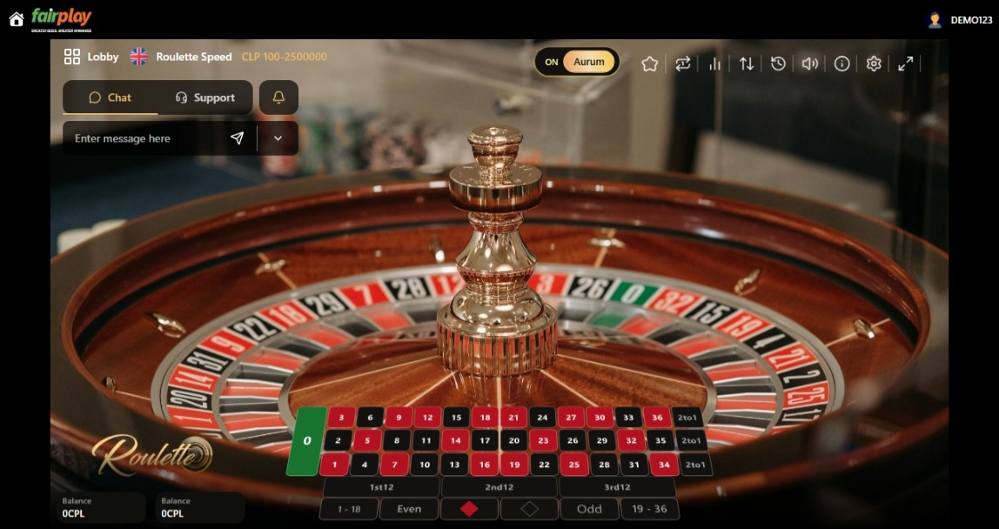

# Casino Detail Page - Snappy Byte Task

## Description
A modern, interactive casino roulette detail page built with React and Vite. The project features a visually rich UI, animated betting table, and responsive design, simulating a real casino experience. It includes a roulette wheel, betting table, balance display, and chat/support sidebar, all styled with Tailwind CSS and Framer Motion for smooth animations.

## How to Run Locally

1. **Clone the repository:**
   ```bash
   git clone https://github.com/UmairZakria/fair-play
   cd snappy-byte
   ```
2. **Install dependencies:**
   ```bash
   npm install
   ```
3. **Start the development server:**
   ```bash
   npm run dev
   ```
4. Open [http://localhost:5173](http://localhost:5173) in your browser to view the app.

## Live Link
[https://fair-play-theta.vercel.app/](https://fair-play-theta.vercel.app/)

## Screenshots


---

### Tech Stack
- React 19
- Vite
- Tailwind CSS
- Framer Motion
- Lucide React Icons

### Features
- Animated roulette wheel and betting table
- Responsive layout for desktop and mobile
- Modern casino-inspired UI
- Chat and support sidebar

---

Feel free to contribute or use this as a starting point for your own casino UI projects!
